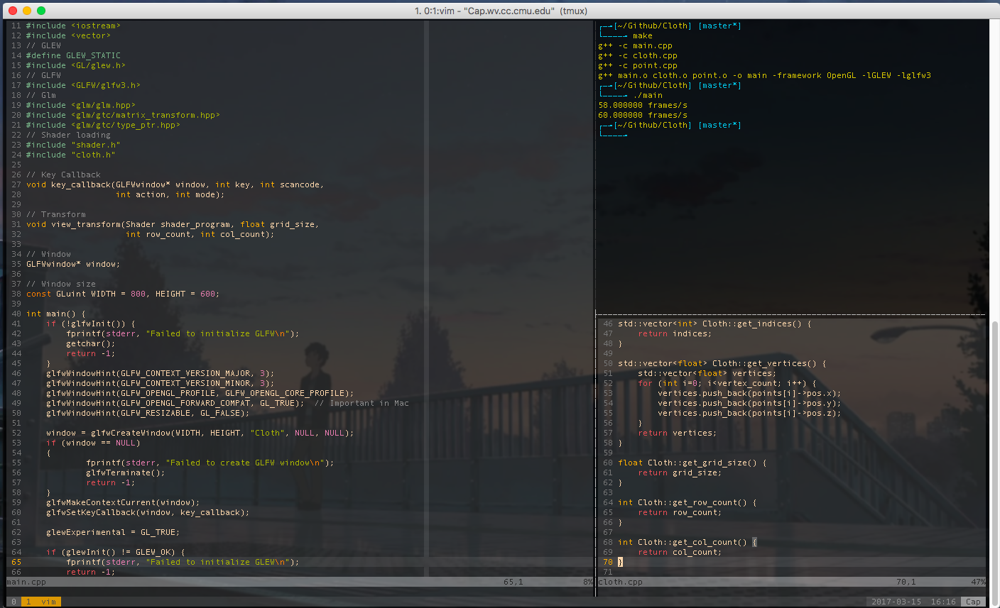

### My Vim, Tmux, Zsh, iTerm2 config files

##### Vim theme: [*gruvbox*](https://github.com/morhetz/gruvbox)
##### Zsh theme: [*classyTouch*](https://github.com/yarisgutierrez/classyTouch_oh-my-zsh)
